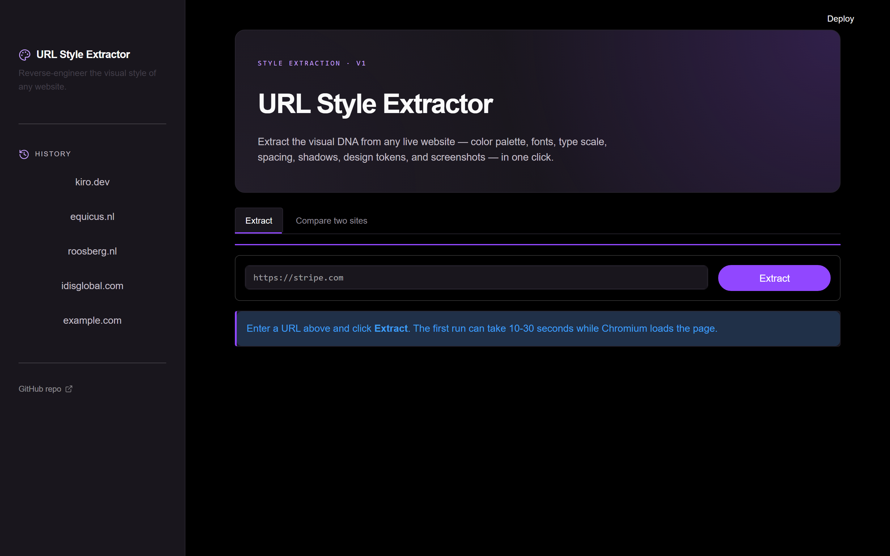
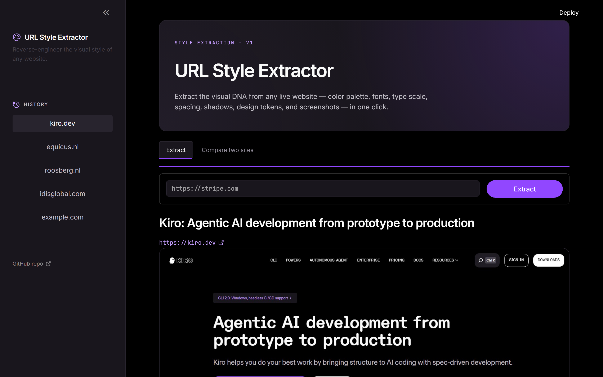
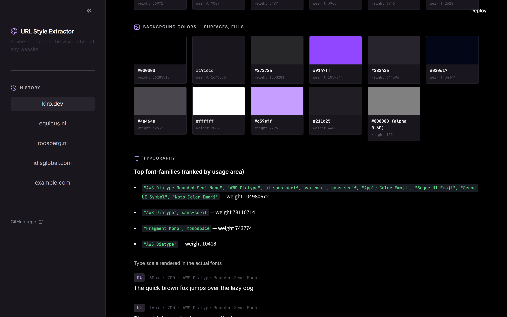
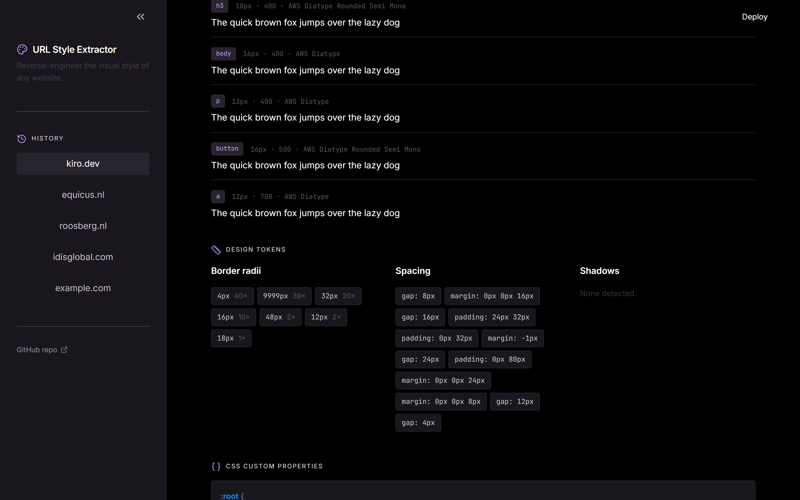
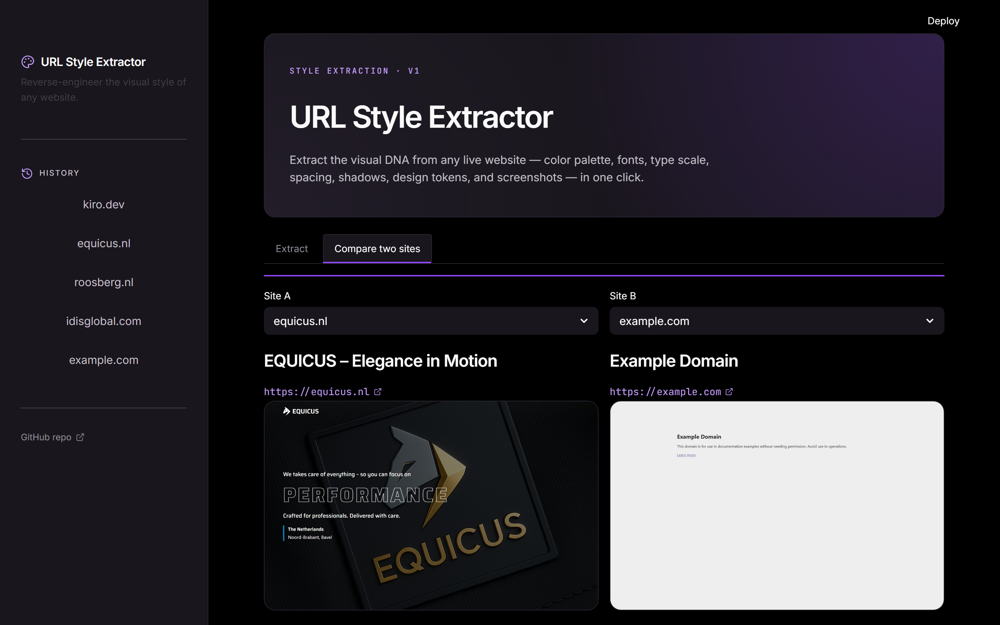

# URL Style Extractor

A Claude Code Skill (and standalone Streamlit app) that reverse-engineers the visual design language of any live website. Paste a URL, hit Extract, and walk away with a hex-coded color palette, the type scale rendered in the page's actual fonts, design tokens, and screenshots — packaged as a markdown moodboard.

The moodboard is meant as input for building a new design system, a follow-up Skill, a redesign brief, or a style guide.



## Highlights

- **One-click extraction** from any public URL via headless Chromium.
- **Color palette ranked by visual area** (foreground vs. backgrounds), not just by occurrence count, so dominant brand colors actually surface.
- **Type scale sampled in the live fonts** — Google Fonts links are detected on the source page and re-injected into the UI, so each `h1`–`h6`/`body`/`p`/`button`/`a` sample renders in its real typeface.
- **Design tokens** lifted straight from the page: every `--*` CSS custom property on `:root`, plus weighted spacing, border radii, and shadow chips.
- **Style-guide generator** turns each extraction into a Claude Code Skill (`styleguide.md`) — frontmatter + color tokens mapped to semantic roles + type scale + "how to apply" rules. Drop it under `.claude/skills/<name>/SKILL.md` and Claude will build UIs in that site's style.
- **Side-by-side compare** — pick two extractions from history and inspect their palettes, type scales, and tokens next to each other.
- **Two consumption surfaces**: a Streamlit UI for humans, and a CLI plus `SKILL.md` for Claude Code.
- **Self-hosting demo**: the UI itself was redesigned by extracting kiro.dev with this very tool — see [`.streamlit/config.toml`](.streamlit/config.toml).

## What it captures

| Section | Source | How it ranks |
|---|---|---|
| Foreground colors | `getComputedStyle(el).color` | Σ of element area in px² |
| Background colors | `getComputedStyle(el).backgroundColor` | Σ of element area in px² |
| Fonts | `font-family` on every visible element | Σ of element area in px² |
| Type scale | computed style on `h1`-`h6`, `body`, `p`, `button`, `a` | direct sample |
| Border radii / shadows | `border-radius`, `box-shadow` | frequency |
| Spacing | `padding`, `margin`, `gap` | frequency |
| CSS custom properties | every `--*` on `:root` | direct dump |
| Google Fonts | `<link href*="fonts.googleapis.com">` | direct |
| `@font-face` | same-origin stylesheets | direct |
| Screenshots | Playwright | 1440×900 above-the-fold + full page |

## Screenshots

Extraction results page rendered in the Kiro-derived dark theme:



Type scale rendered live in the source page's actual font stack:



Design tokens — chips for radii and spacing, plus the `:root` CSS custom properties dump:



Compare two extractions side-by-side to spot stylistic differences:



## Quick start — graphical UI (recommended)

Double-click **`start.bat`** (Windows). On first run it installs the dependencies via the `py` launcher; on every run it launches a Streamlit web app in your browser. Paste a URL, hit **Extract**, and the moodboard renders inline with color swatches, type scale, design tokens, and downloadable `moodboard.md` / `styles.json` / zip.

The sidebar keeps a history of every URL you've extracted, so you can flip back and forth without re-running.

## Setup (manual / non-Windows)

```bash
pip install -r requirements.txt
python -m playwright install chromium
```

Then either run the UI:

```bash
python -m streamlit run app.py
```

…or use the CLI directly:

```bash
# 1. extract
python scripts/extract.py https://stripe.com

# 2. render moodboard
python scripts/render_moodboard.py outputs/stripe.com/styles.json

# 3. generate the Skill / style guide
python scripts/generate_styleguide.py outputs/stripe.com/styles.json
```

Outputs land in `outputs/<domain>/`:

- `styles.json` — raw extracted tokens
- `moodboard.md` — human-readable moodboard
- `styleguide.md` — Claude Code Skill (frontmatter + tokens + rules)
- `screenshot-fold.png` — above-the-fold capture
- `screenshot-full.png` — full-page capture

## Using as a Claude Code Skill

This repo *is* a skill. Drop it into your `.claude/skills/` directory (or install it as a plugin) and Claude will trigger it automatically when you give it a URL and ask for styles, a moodboard, or design tokens.

The trigger phrases live in [SKILL.md](SKILL.md).

## Project layout

```
.
├── SKILL.md                        # Claude Code skill manifest + trigger phrases
├── app.py                          # Streamlit UI
├── start.bat                       # Windows double-click launcher
├── .streamlit/config.toml          # Dark theme + Kiro purple primary
├── requirements.txt                # playwright, streamlit, starlette
├── scripts/
│   ├── extract.py                  # Playwright headless extractor
│   ├── render_moodboard.py         # styles.json → moodboard.md
│   └── generate_styleguide.py      # styles.json → Skill-format styleguide.md
├── docs/
│   ├── capture_screenshots.py      # regenerates the screenshots above
│   └── screenshots/                # README assets
└── outputs/                        # gitignored — extraction results
```

## Limits

- Cross-origin stylesheets may not expose their rules to the page (CORS), so `@font-face` data can be incomplete. Google Fonts is still detected via `<link>` tags.
- Bot-detection (Cloudflare etc.) blocks headless Chromium on some sites.
- Authenticated / private pages aren't supported out of the box.
- Color weighting is by element area — useful for finding dominant colors, but a small accent used in many places (a brand-colored icon, a focused-state ring) may rank lower than a large neutral background.

## License

MIT
